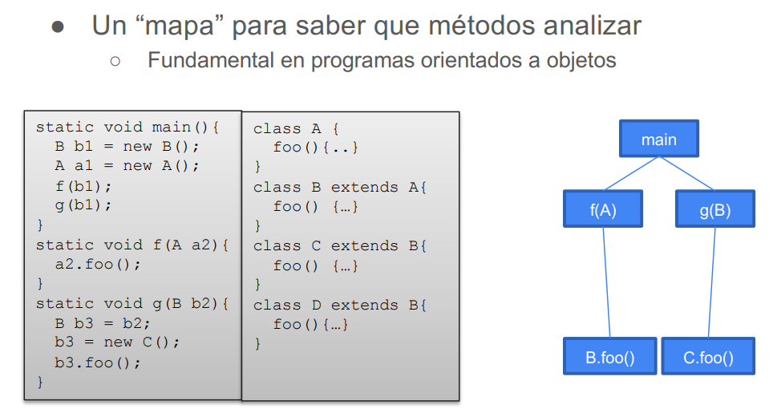

# Control Flow Analysis

Objetivo: Analisar el flujo de llamados entre funciones. Es decir, modelar los posibles llamados a funciones en los distintos puntos del programa que utilizen funciones de primer orden (funciones como variables)

Para ello se buscara construir un Call graph que modele todos los posibles llamados a funciones. El reticulado que se usa es el del conjunto de partes de todos los nombres de funciones, por ejemplo $P(main, foo, inc, dec, ide), \subseteq$. Y las restricciones del dataflow se definen cómo:

La última restricción sirve para llamados a funciones que no sabemos a priori a que función hace referencia (info que vamos obteniendo por el dataflow). Por ejemplo si la función a llamar viene como input. Entocnes si $f$ pertenece a los posibles funciones a llamar, se define las restricciones por los parametros de la función y el valor de retorno.

Si ya se sabe que función se va a llamar podemos usar la restricción incondicional:

Ejemplo:

## Para POO

Para el siguiente ejemplo la función f llama a B.foo por el parámetro que le pasan, y g crea y llama a C.foo

CHA recorre la estructura declarada de cada clase e infiere las posibles llamadas.

RTA recorre el programa buscando instancias de objetos y con ellos infiere los posibles llamados (además de los tipos de los objetos).

