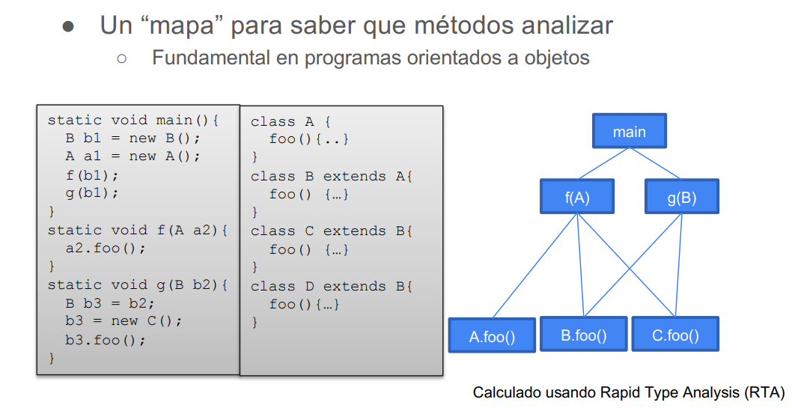

# Control Flow Analysis

Objetivo: Analisar el flujo de llamados entre funciones. Es decir, modelar los posibles llamados a funciones en los distintos puntos del programa que utilizen funciones de primer orden (funciones como variables)

Para ello se buscara construir un Call graph que modele todos los posibles llamados a funciones. El reticulado que se usa es el del conjunto de partes de todos los nombres de funciones, por ejemplo $P(main, foo, inc, dec, ide), \subseteq$. Y las restricciones del dataflow se definen cómo:

{width=70%}

La última restricción sirve para llamados a funciones que no sabemos a priori a que función hace referencia (info que vamos obteniendo por el dataflow). Por ejemplo si la función a llamar viene como input. Luego si $f$ pertenece a los posibles funciones a llamar, se define las restricciones por los parametros de la función y el valor de retorno.

Si ya se sabe que función se va a llamar podemos usar la restricción incondicional:

{width=70%}

Ejemplo:

{width=70%}
{width=30%}

## Para POO

Objetivo: Analisar el flujo de llamado de métodos teniendo en cuenta la definición de clases. (polimorfismo y herencia)

Para el siguiente ejemplo la función $f$ llama a $B.foo$ por el parámetro que le pasan, y $g$ crea un objeto de tipo $C$ y llama a $C.foo$

{width=70%}

CHA recorre la estructura declarada de cada clase e infiere las posibles llamadas. Como $f$ recibe un objeto de tipo A y este es superclase de B que a su vez es superclase de C y D, entonces se podría llamar a foo() de cualquiera de estas clases. Analogamente, en $g$ se crea un objeto de tipo B que es superclase de C y D, por lo que puede llamar a foo() de dichas clases.

{width=70%}

RTA recorre el programa buscando instancias de objetos y con ellos infiere los posibles llamados (además de usando los tipos de los objetos).

{width=70%}

