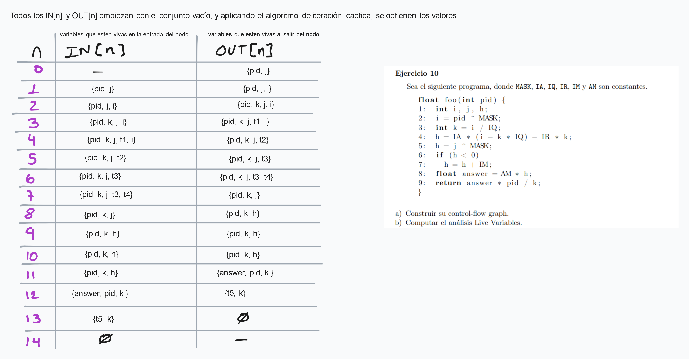
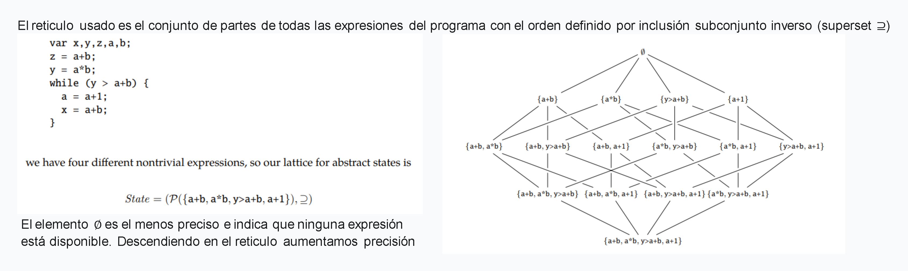
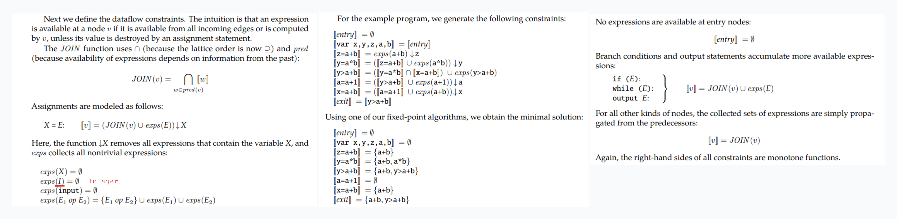
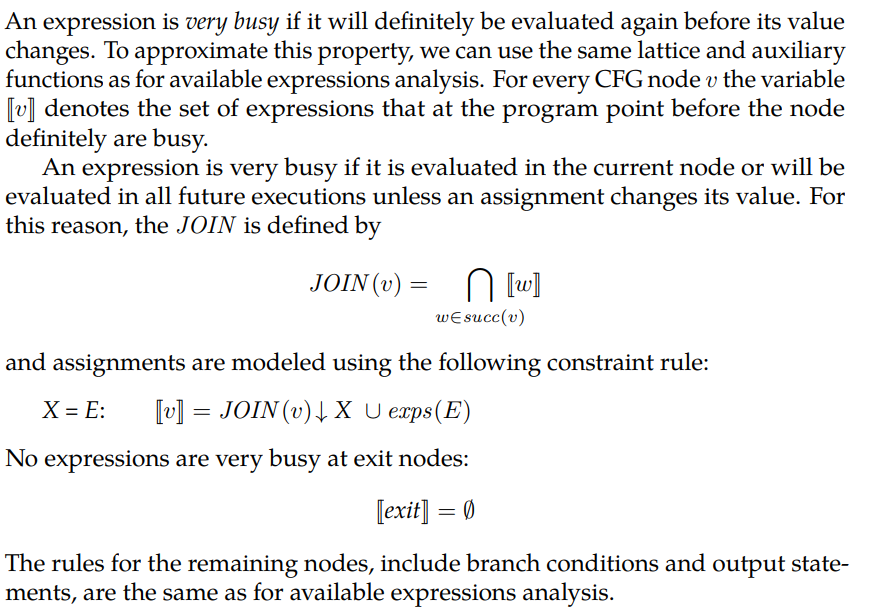
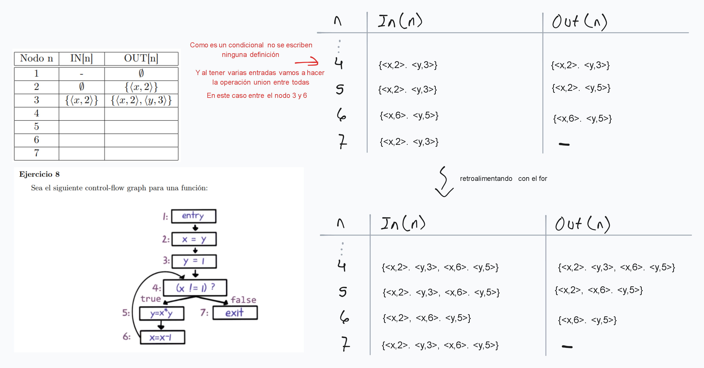

## Live variable analysis

En cada punto del programa ver qué variables están vivas: si hay un "camino" que la utiliza sin redefinirla.
Es un analisis backward (usa info de los sucesores para inferir propiedades del nodo) y may (ante información que se pisa, redondea para arriba en el reticulado)

## Available expresions

Ver por cada punto de programa qué expresiones ya estan computadas y no fueron modificadas. Se computa las expresiones dadas por todos los caminos hacia ese punto del programa

Por lo tanto es un analisis forward must, toma la información de las expresiones de los predecesores de un nodo (punto de un programa) y calcula las expresiones disponibles

## Very busy expresions

Es un analisis backward must. Busca las expresiones que van a ser utilizadas nuevamente antes de redefinirlas en dicho punto de programa.

{width=60%}

En el siguiente programa la expresion $a*b$ es very busy en el loop
{width=20%}

## Reaching definitions

El conjunto de definiciones que pueden llegar a un punto de un programa. Se define como un par < variable, nodo en el que se definió >. Es un analisis forward may.

