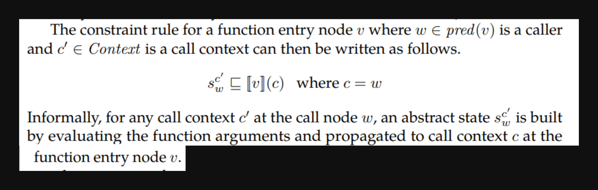
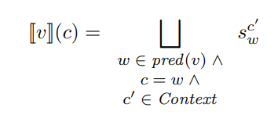
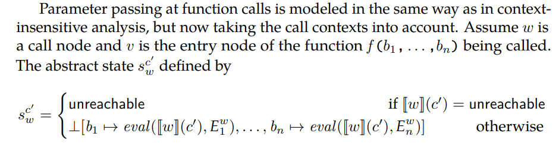
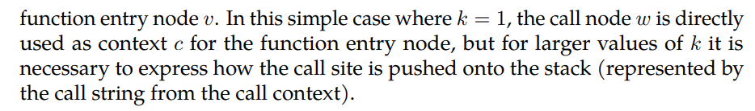
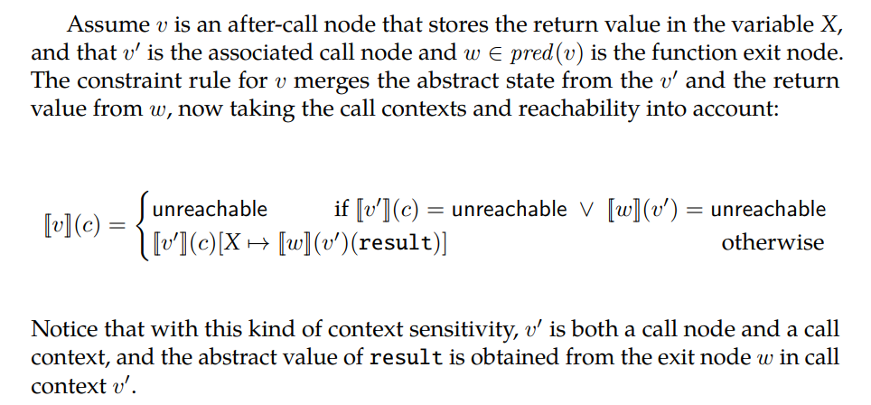

Para contexto dado por call strings lo que se hace es modelar el contexto como los k ultimos elementos del stack

## Call node y function node

Ahora bien, el ejemplo donde k=1 solo tenemos un elemento del stack. Por lo que las restricciones del call-node (el de la entrada de la función): 

Quiere decir lo siguiente:

- $\llbracket v \rrbracket(c)$: Como k=1 entonces el contexto se define como el ultimo elemento del stack, es decir del nodo que está llamando a la función. Por eso se define $c=w$ para $w∈ pred(v)$. Es decir, para el nodo $v$ se define un contexto por cada nodo que lo llama.
- Dicho contexto se calcula con la union de todos los contextos del nodo $w$ 

Es decir, defino un contexto para $v$ por cada nodo llamador (predecesor) y cada uno lo calculo con los contextos $c'$ del nodo llamador 

## After call node

El resultado es obtenido tomando el mismo contexto que el call node $\llbracket v \rrbracket(c) = \llbracket v' \rrbracket(c)[...]$ y agregando el resultado que se obtiene de la función usando el contexto del call node: $\llbracket w \rrbracket(v')(result)$