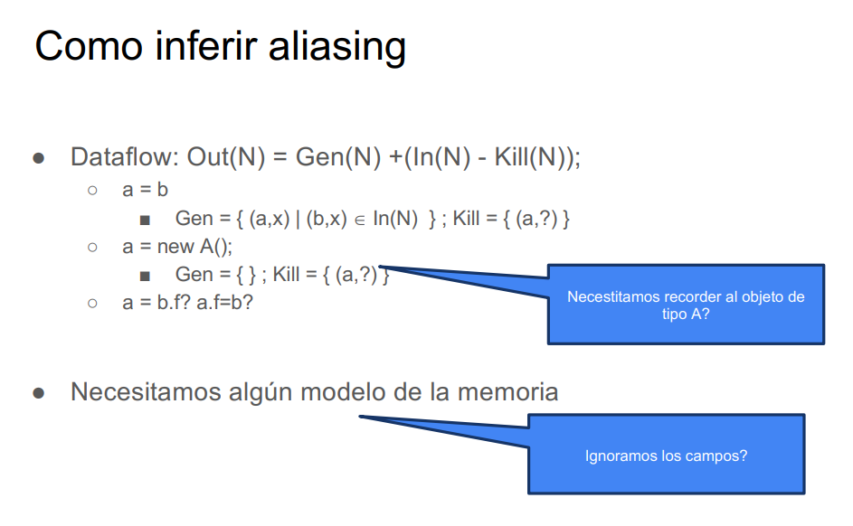
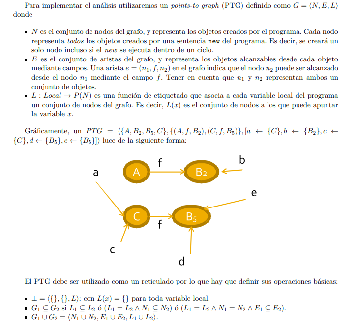
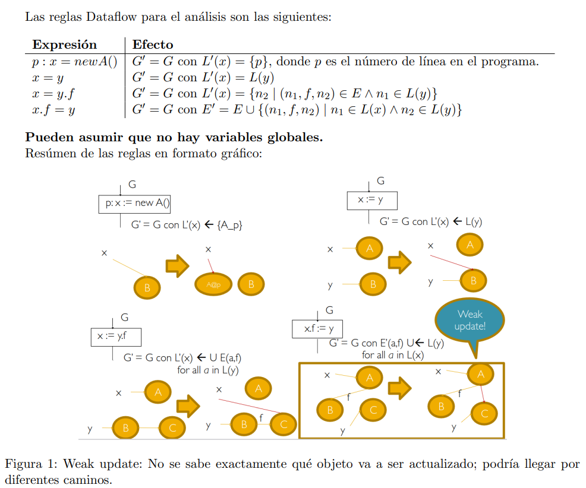
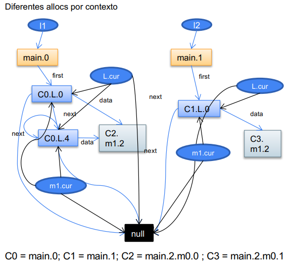
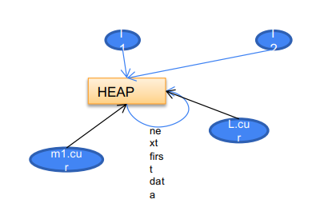
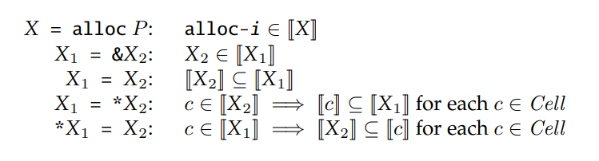

# Alias analysis

Objetivo: Hacer un analisis del código para modelar aliasing

> aliasing: multiples variables apuntan a la misma posición en memoria de forma directa o indirecta. (Para la interpretación de modelado: multiples variables representan la misma locación mutable)

El analisis puede ser may alias (pueden cumplirse para algún camino) o must alias (se cumple para todo camino)

{width=50%}{width=50%}

Con este modelado de generar tuplas no podemos modelar campos (a = b.f; a.f = b). Para ello necesitamos alguna forma de modelar la memoria (en particular el heap).

# Points-to analysis

Objetivo: armar un analisis que nos diga a donde apunta cada puntero

Un anlisis de points-to es un may forward dataflow analysis que permite determinar a que objetos puede apuntar una variable durante la ejecución de un programa.

Se simplifica a 4 operaciones

```java
x = new C(); // new
x = y // copy
x = y.f // load
x.f = y // store
```

## Tipos de analisis

- Sensibles a flujo: computan un analisis points-to para cada punto del programa (son caros)
- Insensibles al flujo: hacen un analisis points-to para todo el programa en general y todas las asignaciones son no destructivas. Hay 2 tipos
  - Andersen: basado en inclusión
  - Steengard: basado en unificación (no entra en el parcial)
- Sensibles a contexto: Pueden distinguir entre distintos llamados a metodos.

## Points-to Graph (PTG)

Grafo donde tengo nodos por cada objeto (basicamente por cada new), nodos por cada puntero (o variable de tipo objeto, basicametne para trackear el aliasing), y ejes según las relaciones entre objetos, sus campos, y variables (punteros).

{width=50%}{width=50%}

### 4ta operación dataflow

El weak update se justifica porque se tiene un analisis may. En el siguiente caso tenemos que x apunta a A y B. Luego si hacemos $x.f = y$ no sabemos si actualizar el campo $f$ de $A$ o $B$. Por eso ponemos ambas aristas. 

{width=50%} {width=50%}

El PTG como reticulado calcula un PTG por cada punto del porgrama empezando con el grafo vacio y siguiendo la regla de inclusión definida en las operaciones del reticulado (imagen).

## Abstracciones del heap

Podemos modelar el heap como un solo nodo, un nodo por cada allocation site (cada new). Este ultimo soluciona el problema de tener un new dentro de un bucle, en tal caso tendriamos que modelar que cada iteración es un objeto nuevo.

```java
...
while(i < k) {
    A a = new A();
    b[i] = a;
    ...
}
...
```

{width=50%}{width=50%}

{width=40%}


## Andersen 

Se basa en inclusiones: $p = q, pt(q) \subseteq pt(p)$. Es insensible a contexto y flujo (analisa todo el programa de una). Analisis may.

El algoritmo consiste en recorrer el codigo calculando las restricciones y luego resolverlas con la operación de inclusión hasta llegar a un punto fijo.


{width=50%}


En palabras, cada instrucción define restricciones a cumplir sobre los objetos del programa:

$x = new(A)$: A pertenece a los objetos apuntados por $x$

$x = y$: el conjunto de objetos apuntados por $x$ deben tener a todos los objetos apuntados por y. (No se borran aristas, en la imagen justo se tapa pero la arista $a -> A$ no se borró).

$x = y.f$: los objetos apuntados por $x$ deben tener a todos los objetos alcanzables por $y$ a travez de $f$

$x.f = y$: todos los objetos apuntas por $y$ tienen que pertenecer a la intersección del conjunto de objetos formado por los objetos alcanzables por $x$ a travez de $f$
