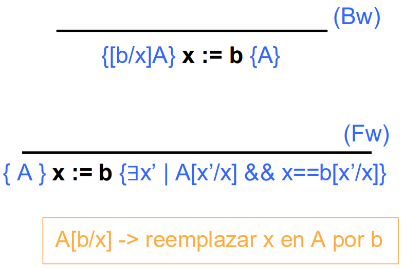
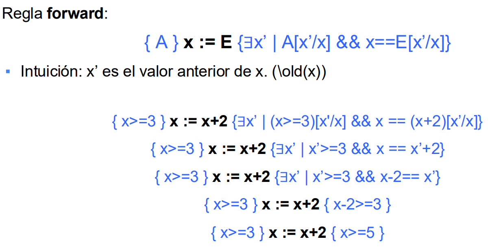
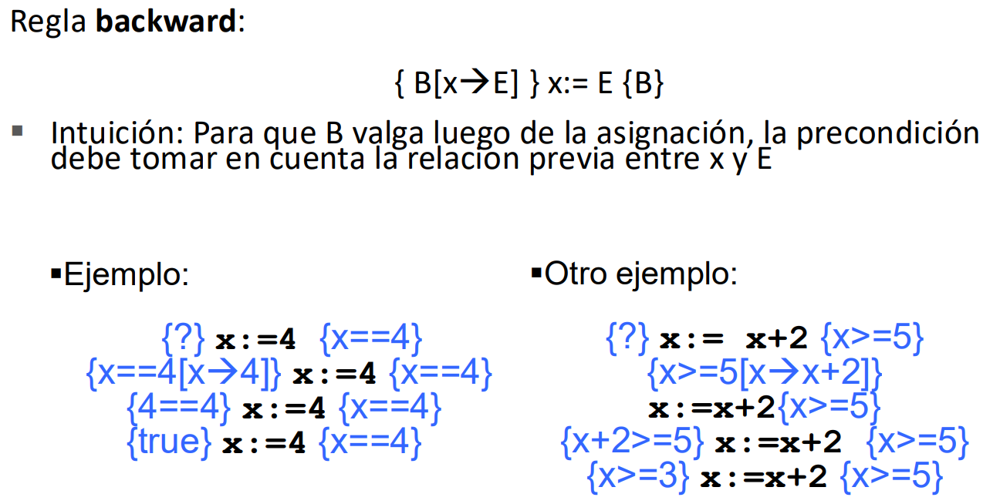
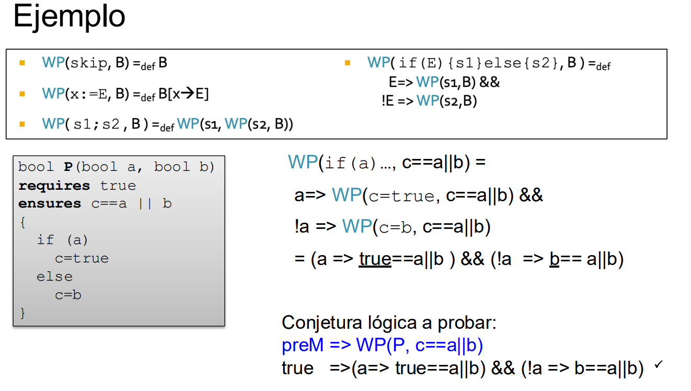
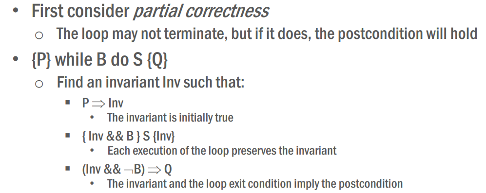
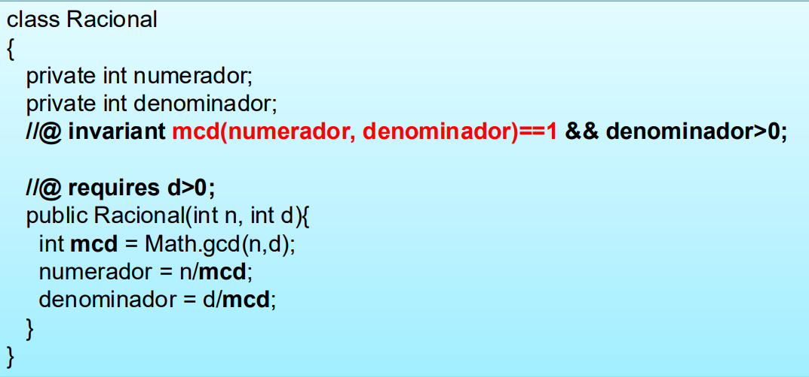
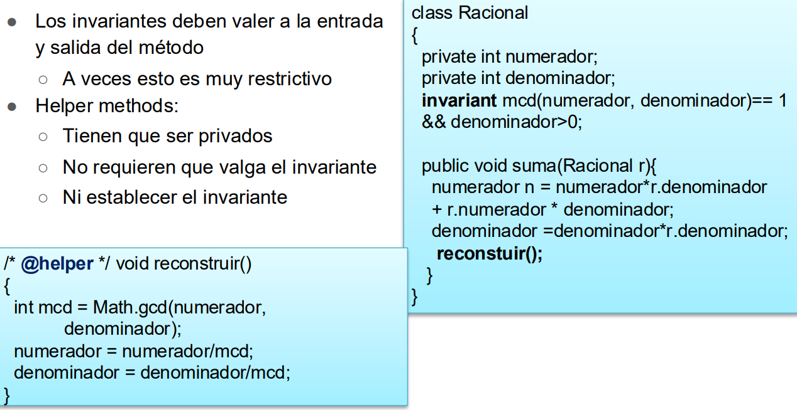
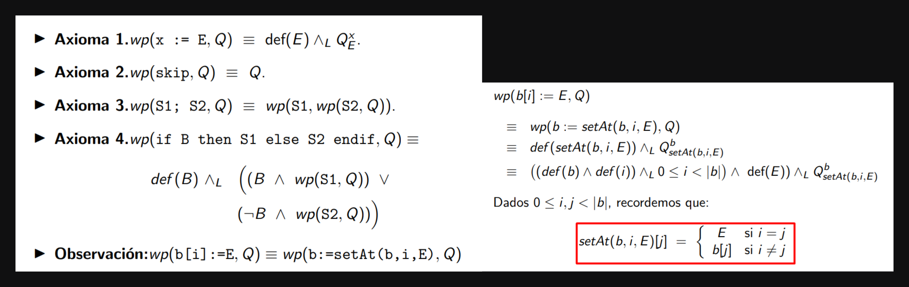

## Objetivo

Dada una especificación S de un programa P, proveer una demostración rigurosa de que cualquier ejecución de P cumple con S

Dada una especificación S y un programa P generar un conjunto de fórmulas lógicas que, de ser derivables en base a un conjunto de axiomas y reglas de inferencia, implican que P cumple con S.
Los predicados pueden ser demostrados de manera manual, con demostración semiautomática o con demostradores automáticos de fórmulas
No poder demostrar la fórmula no implica necesariamente que el programa contenga un error. Es decir, el verificador puede devolver proven (true o false) o unknown.


Ejemplo de un contrato

```java

//@ requires x > 0
//@ ensures result*result == x
float raizCuadrada(int x) {
    return Math.sqrt(x);
}

```


Para esto necesitamos traducir el programa y el contrato a una lógica en común. Una posibilidad es representar la semántica del programa con axiomas. El programa es un teorema del conjuntos de axiomas y reglas de inferencia

## Hoare

### Triplas y lógica

{A} codigo {B}: Si el programa comienza con estado A y la ejecución del código termina, entonces el estado final cumple B. (Notar correctitud parcial: SI el codigo termina entonces ..., total se obtiene probando que termina).

{width=50%}

provee un conjunto de reglas deductivas para probar la correctitud de programas respecto a la estructura de sentencias de programas imperativos.
La lógica de Hoare modela cómo cada operación modifica el estado del sistema en término de predicados lógicos.

### Lenguaje y reglas

```java
skip    // nada
x:=e    // asignación
s1;s2   // secuencia

if (cond) {s1} else {s2}    // condicional
while (cond) {s}            // iteración
```

- Backward (bw): sirve para calcular la Weakest Precondition (para {P} S {Q} si $\forall P' (P' \implies P)$ entocnes P es la WP)
    > una tripla es válida si la precondición es más fuerte que la WP ($P \implies WP$)

- Forward (fw): sirve para calcular la Strongest Postcondition (para {P} S {Q} si $\forall Q' (Q \implies Q')$ entonces Q es la SP)
    > una tripla es válida si la postcondición es más debil que la SP ($SP \implies Q$) (Es más dificil de computar)

{width=30%}{width=30%}

{width=50%}{width=50%}

### Verfication Condition

Dado un contrato $M$ ($pre_M, post_M$), calcular una formula lógica que permita inferir la correctitud del programa. (Si la fórmula es verdadera, el programa cumple el contrado)

- Forward: Dado {$pre_M$} S {$post_M$} calculo $SP(S, pre_M)$ y verifico que  $SP(S, pre_M)$ $\implies$ {$post_M$}, es decir que la postcondición más fuerte que puedo armar con la $pre_M$ sea más fuerte que lo que pide la $post_M$ (post del contrato)

- Backward:  Dado {$pre_M$} S {$post_M$} calculo $WP(S, post_M)$ y verifico que {$pre_M$} $\implies$ $WP(S, post_M)$, es decir que la precondición del contrato sea más restrictiva que la WP

### Calcular WP

{width=40%}{width=50%}

{width=80%}

#### Solucion ciclos: loop unroling

Es una solución unsafe porque puede dar una precondición más debil que la WP

{width=80%}

En este ejemplo $pre_M \implies WP'$ y $WP \implies WP'$ por ser más debil, pero $pre_M$ no implica la $WP$. Dando erroneamente que el programa con la especificación es correcto.

#### Solucion ciclos: invariantes de ciclo

No garantiza terminación

{width=40%}{width=50%}

#### Extensión de lenguaje

```java
WP(assume E, B) == (E => B)
WP(assert E, B) == (E && B)
// para todo valor de x vale B
WP(havoc x, B) == \forall x. B 
```
{width=60%}

### Tratamiento de llamadas

[ x/j ] a x asignale j

{width=60%}

{width=55%}

### Invariante de representación

Es un predicado que deben cumplir todas las instancias de la clase. Al llamar a un método el invariante vale antes y despues (durante la ejecución puede romperse siempre y cuando se recomponga para el final).

{width=60%}

{width=60%}

