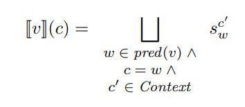
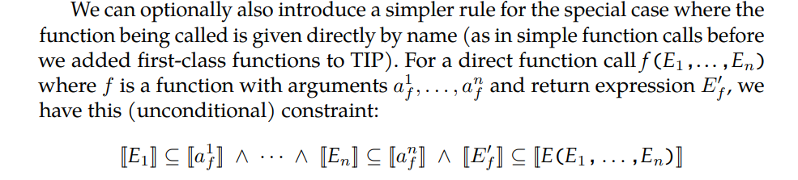
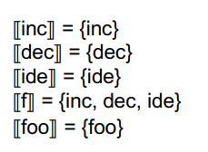
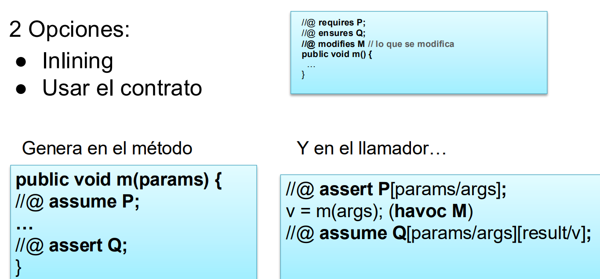

# Dataflow

## Live variable analysis

En cada punto del programa ver qué variables están vivas: si hay un "camino" que la utiliza sin redefinirla.
Es un analisis backward (usa info de los sucesores para inferir propiedades del nodo) y may (ante información que se pisa, redondea para arriba en el reticulado)


## Available expresions

Ver por cada punto de programa qué expresiones ya estan computadas y no fueron modificadas. Se computa las expresiones dadas por todos los caminos hacia ese punto del programa

Por lo tanto es un analisis forward must, toma la información de las expresiones de los predecesores de un nodo (punto de un programa) y calcula las expresiones disponibles


## Very busy expresions

Es un analisis backward must. Busca las expresiones que van a ser utilizadas nuevamente antes de redefinirlas en dicho punto de programa.

{width=60%}

En el siguiente programa la expresion $a*b$ es very busy en el loop
{width=20%}

## Reaching definitions

El conjunto de definiciones que pueden llegar a un punto de un programa. Se define como un par < variable, nodo en el que se definió >. Es un analisis forward may.


# Interprocedural

## Call strings

Para contexto dado por call strings lo que se hace es modelar el contexto como los k ultimos elementos del stack

### Call node y function node

Ahora bien, el ejemplo donde k=1 solo tenemos un elemento del stack. Por lo que las restricciones del call-node (el de la entrada de la función): 

{width=60%}{width=40%}

Quiere decir lo siguiente:


- $[v](c)$: Como k=1 entonces el contexto se define como el ultimo elemento del stack, es decir del nodo que está llamando a la función. Por eso se define $c=w$ para $w \in pred(v)$. Es decir, para el nodo $v$ se define un contexto por cada nodo que lo llama.
- Dicho contexto se calcula con la union de todos los contextos del nodo $w$ 
{width=70%}

Es decir, defino un contexto para $v$ por cada nodo llamador (predecesor) y cada uno lo calculo con los contextos $c'$ del nodo llamador 

{width=70%}

### After call node

{width=70%}

El resultado es obtenido tomando el mismo contexto que el call node $[v](Interprocedural_analysis/c) = [v'](Interprocedural_analysis/c)[...]$ y agregando el resultado que se obtiene de la función usando el contexto del call node: $[w](Interprocedural_analysis/v')(result)$

## functional

Se modela el contexto como los posibles estados que puede tomar las variables.

Ejemplo: Los 2 llamados a la función definen el contexto. En este caso con los valores 0 y + (para sign analysis) el resto unreachable

{width=50%}

### Call node y function node

{width=50%}{width=50%}

En palabras $S_w^{c'}$ es el estado formado a partir de los datos del nodo $w$ en el contexto $c'$. 

Dependiendo la elección del contexto, $c'$ puede ser un call string (si k=1 seria simplemente un call node) o en el caso funcinal sería un estado que define valores de las variables de entrada de la función a la que pertenece el nodo $w$. 

Si con dicho contexto $c'$, $w$ no es alcanzable entonces $[w](Interprocedural_analysis/c') = unreachable$

### After call node

{width=60%}

Del mismo modo que en call string, el resultado se define en el mismo contexto del call node $[v](Interprocedural_analysis/c) = [v'](Interprocedural_analysis/c)[...]$ y usando el resultado de la función a partir de dicho contexto del call node (del estado formado por el contexto del call node en este caso): $[w](Interprocedural_analysis/S_w^{c'})(result)$


# Control Flow Analysis

Objetivo: Analisar el flujo de llamados entre funciones. Es decir, modelar los posibles llamados a funciones en los distintos puntos del programa que utilizen funciones de primer orden (funciones como variables)

Para ello se buscara construir un Call graph que modele todos los posibles llamados a funciones. El reticulado que se usa es el del conjunto de partes de todos los nombres de funciones, por ejemplo $P(main, foo, inc, dec, ide), \subseteq$. Y las restricciones del dataflow se definen cómo:

{width=70%}

La última restricción sirve para llamados a funciones que no sabemos a priori a que función hace referencia (info que vamos obteniendo por el dataflow). Por ejemplo si la función a llamar viene como input. Luego si $f$ pertenece a los posibles funciones a llamar, se define las restricciones por los parametros de la función y el valor de retorno.

Si ya se sabe que función se va a llamar podemos usar la restricción incondicional:

{width=70%}

Ejemplo:

{width=70%}
{width=30%}


## Para POO

Objetivo: Analisar el flujo de llamado de métodos teniendo en cuenta la definición de clases. (polimorfismo y herencia)

Para el siguiente ejemplo la función $f$ llama a $B.foo$ por el parámetro que le pasan, y $g$ crea un objeto de tipo $C$ y llama a $C.foo$

{width=70%}

CHA recorre la estructura declarada de cada clase e infiere las posibles llamadas. Como $f$ recibe un objeto de tipo A y este es superclase de B que a su vez es superclase de C y D, entonces se podría llamar a foo() de cualquiera de estas clases. Analogamente, en $g$ se crea un objeto de tipo B que es superclase de C y D, por lo que puede llamar a foo() de dichas clases.

{width=70%}

RTA recorre el programa buscando instancias de objetos y con ellos infiere los posibles llamados (además de usando los tipos de los objetos).

{width=70%}


# Alias analysis

Objetivo: Hacer un analisis del código para modelar aliasing

> aliasing: multiples variables apuntan a la misma posición en memoria de forma directa o indirecta. (Para la interpretación de modelado: multiples variables representan la misma locación mutable)

El analisis puede ser may alias (pueden cumplirse para algún camino) o must alias (se cumple para todo camino)

{width=50%}{width=50%}

Con este modelado de generar tuplas no podemos modelar campos (a = b.f; a.f = b). Para ello necesitamos alguna forma de modelar la memoria (en particular el heap).

# Points-to analysis

Objetivo: armar un analisis que nos diga a donde apunta cada puntero

Un anlisis de points-to es un may forward dataflow analysis que permite determinar a que objetos puede apuntar una variable durante la ejecución de un programa.

Se simplifica a 4 operaciones

```java
x = new C(); // new
x = y // copy
x = y.f // load
x.f = y // store
```

## Tipos de analisis

- Sensibles a flujo: computan un analisis points-to para cada punto del programa (son caros)
- Insensibles al flujo: hacen un analisis points-to para todo el programa en general y todas las asignaciones son no destructivas. Hay 2 tipos
  - Andersen: basado en inclusión
  - Steengard: basado en unificación (no entra en el parcial)
- Sensibles a contexto: Pueden distinguir entre distintos llamados a metodos.

## Points-to Graph (PTG)

Grafo donde tengo nodos por cada objeto (basicamente por cada new), nodos por cada puntero (o variable de tipo objeto, basicametne para trackear el aliasing), y ejes según las relaciones entre objetos, sus campos, y variables (punteros).

{width=50%}{width=50%}

### 4ta operación dataflow

El weak update se justifica porque se tiene un analisis may. En el siguiente caso tenemos que x apunta a A y B. Luego si hacemos $x.f = y$ no sabemos si actualizar el campo $f$ de $A$ o $B$. Por eso ponemos ambas aristas. 

{width=50%} {width=50%}

El PTG como reticulado calcula un PTG por cada punto del porgrama empezando con el grafo vacio y siguiendo la regla de inclusión definida en las operaciones del reticulado (imagen).

## Abstracciones del heap

Podemos modelar el heap como un solo nodo, un nodo por cada allocation site (cada new). Este ultimo soluciona el problema de tener un new dentro de un bucle, en tal caso tendriamos que modelar que cada iteración es un objeto nuevo.

```java
...
while(i < k) {
    A a = new A();
    b[i] = a;
    ...
}
...
```

{width=50%}{width=50%}

{width=40%}


## Andersen 

Se basa en inclusiones: $p = q, pt(q) \subseteq pt(p)$. Es insensible a contexto y flujo (analisa todo el programa de una). Analisis may.

El algoritmo consiste en recorrer el codigo calculando las restricciones y luego resolverlas con la operación de inclusión hasta llegar a un punto fijo.


{width=50%}


En palabras, cada instrucción define restricciones a cumplir sobre los objetos del programa:

$x = new(A)$: A pertenece a los objetos apuntados por $x$

$x = y$: el conjunto de objetos apuntados por $x$ deben tener a todos los objetos apuntados por y. (No se borran aristas, en la imagen justo se tapa pero la arista $a -> A$ no se borró).

$x = y.f$: los objetos apuntados por $x$ deben tener a todos los objetos alcanzables por $y$ a travez de $f$

$x.f = y$: todos los objetos apuntas por $y$ tienen que pertenecer a la intersección del conjunto de objetos formado por los objetos alcanzables por $x$ a travez de $f$


# Verification

Dada una especificación S de un programa P, proveer una demostración rigurosa de que cualquier ejecución de P cumple con S

Dada una especificación S y un programa P generar un conjunto de fórmulas lógicas que, de ser derivables en base a un conjunto de axiomas y reglas de inferencia, implican que P cumple con S.
Los predicados pueden ser demostrados de manera manual, con demostración semiautomática o con demostradores automáticos de fórmulas
No poder demostrar la fórmula no implica necesariamente que el programa contenga un error. Es decir, el verificador puede devolver proven (true o false) o unknown.


Ejemplo de un contrato

```java

//@ requires x > 0
//@ ensures result*result == x
float raizCuadrada(int x) {
    return Math.sqrt(x);
}

```

Para esto necesitamos traducir el programa y el contrato a una lógica en común. Una posibilidad es representar la semántica del programa con axiomas. El programa es un teorema del conjuntos de axiomas y reglas de inferencia

## Hoare

### Triplas y lógica

{A} codigo {B}: Si el programa comienza con estado A y la ejecución del código termina, entonces el estado final cumple B. (Notar correctitud parcial: SI el codigo termina entonces ..., total se obtiene probando que termina).

{width=50%}

provee un conjunto de reglas deductivas para probar la correctitud de programas respecto a la estructura de sentencias de programas imperativos.
La lógica de Hoare modela cómo cada operación modifica el estado del sistema en término de predicados lógicos.

### Lenguaje y reglas

```java
skip    // nada
x:=e    // asignación
s1;s2   // secuencia

if (cond) {s1} else {s2}    // condicional
while (cond) {s}            // iteración
```

- Backward (bw): sirve para calcular la Weakest Precondition (para {P} S {Q} si $\forall P' (P' \implies P)$ entocnes P es la WP)
    > una tripla es válida si la precondición es más fuerte que la WP ($P \implies WP$)

- Forward (fw): sirve para calcular la Strongest Postcondition (para {P} S {Q} si $\forall Q' (Q \implies Q')$ entonces Q es la SP)
    > una tripla es válida si la postcondición es más debil que la SP ($SP \implies Q$) (Es más dificil de computar)

{width=30%}{width=30%}

{width=50%}{width=50%}

### Verfication Condition

Dado un contrato $M$ ($pre_M, post_M$), calcular una formula lógica que permita inferir la correctitud del programa. (Si la fórmula es verdadera, el programa cumple el contrado)

- Forward: Dado {$pre_M$} S {$post_M$} calculo $SP(S, pre_M)$ y verifico que  $SP(S, pre_M)$ $\implies$ {$post_M$}, es decir que la postcondición más fuerte que puedo armar con la $pre_M$ sea más fuerte que lo que pide la $post_M$ (post del contrato)

- Backward:  Dado {$pre_M$} S {$post_M$} calculo $WP(S, post_M)$ y verifico que {$pre_M$} $\implies$ $WP(S, post_M)$, es decir que la precondición del contrato sea más restrictiva que la WP

### Calcular WP

{width=40%}{width=50%}

{width=80%}

#### Solucion ciclos: loop unroling

Es una solución unsafe porque puede dar una precondición más debil que la WP

{width=80%}

En este ejemplo $pre_M \implies WP'$ y $WP \implies WP'$ por ser más debil, pero $pre_M$ no implica la $WP$. Dando erroneamente que el programa con la especificación es correcto.

#### Solucion ciclos: invariantes de ciclo

No garantiza terminación

{width=40%}{width=50%}

#### Extensión de lenguaje

```java
WP(assume E, B) == (E => B)
WP(assert E, B) == (E && B)
// para todo valor de x vale B
WP(havoc x, B) == \forall x. B 
```
{width=60%}

### Tratamiento de llamadas

[ x/j ] a x asignale j

{width=60%}

{width=55%}

### Invariante de representación

Es un predicado que deben cumplir todas las instancias de la clase. Al llamar a un método el invariante vale antes y despues (durante la ejecución puede romperse siempre y cuando se recomponga para el final).

{width=60%}

{width=60%}

